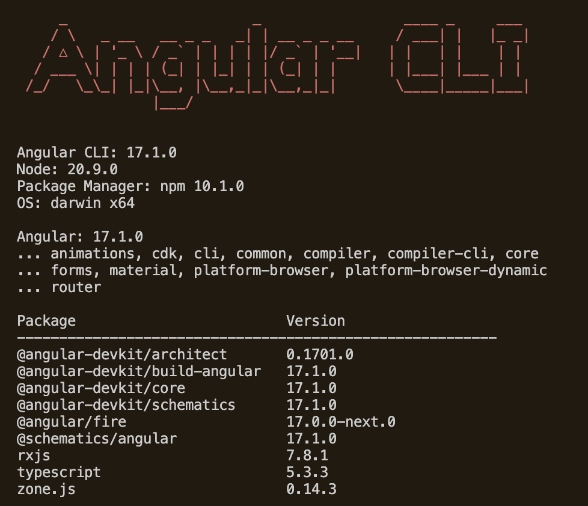
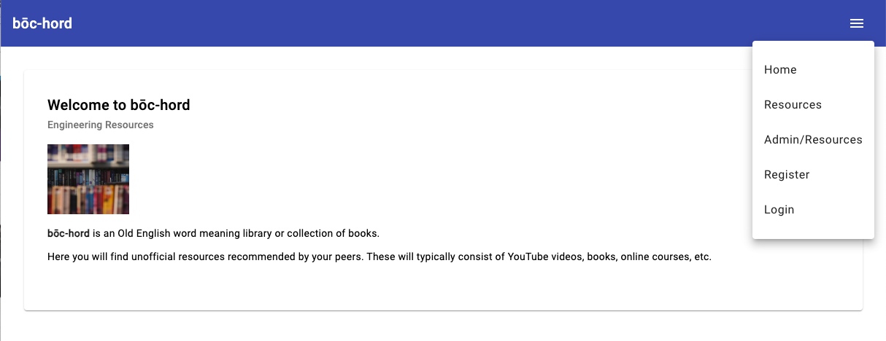
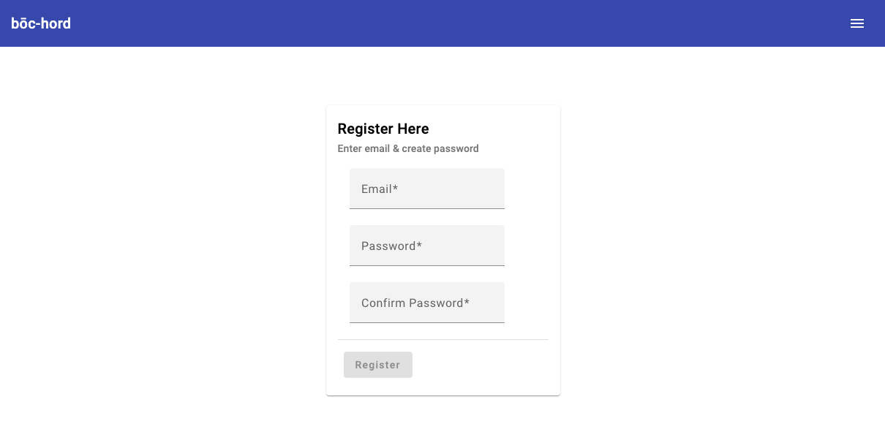
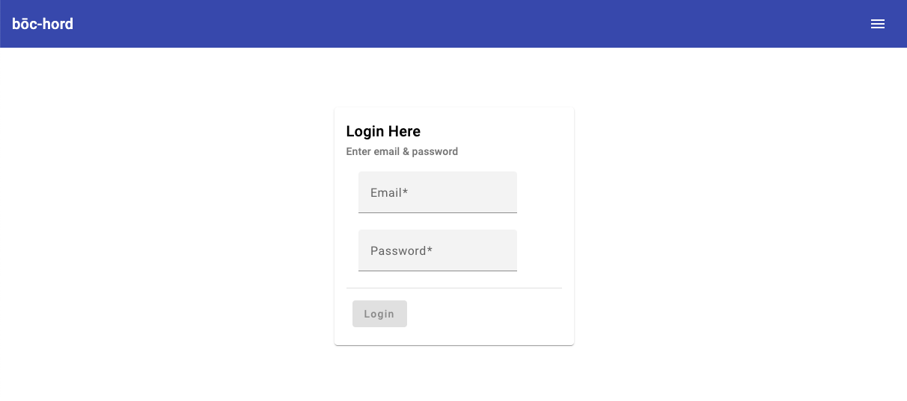
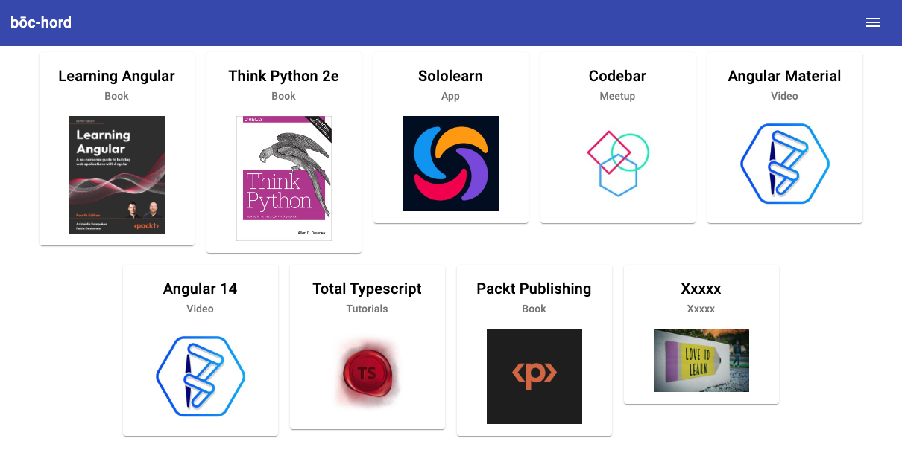
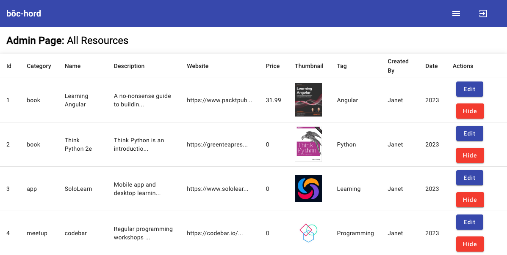

# Software Engineering and DevOps Resources

Origin of the app's name **bōc-hord** is Old English meaning library or collection of books. [Link to meaning of bōc-hord](https://oldenglishwordhord.com/2020/08/25/boc-hord/) 

This app will include resources recommended by users for engineers of all levels. These will include:

- books
- articles
- videos
- courses
- communities
- products
- websites

# Project - current version

<h2 align="left"></h2>

## Live site deployed on Firebase 

### [resources-ng app](https://resources-ng.web.app/)

## Screenshots

### Home on /home

<h2 align="left"></h2>

### Register on /register

<h2 align="left"></h2>

### Login on /login

<h2 align="left"></h2>

### Resources on /resources

<h2 align="left"></h2>

### Resource detail on /resources/detail

<h2 align="left"></h2>

### Table in /admin/resources [seen in login only]

<h2 align="left"></h2>

# Project - still to do

- improve login/register components (reactive forms)
- add notifications
- add profile page
- etc.

# Credits

[Angular Material Course 2022](https://www.youtube.com/watch?v=DaE_RpWRlJI&t=4285s) from Bitfumes, which inspired this project.

[Bitfumes' Material course on GitHub](https://github.com/bitfumes/angular-material-2022/tree/main) by @sarthaksavvy.

[V15 Angular Material](https://v15.material.angular.io/) which was used to structure the user interface.

[Tailwind CSS](https://tailwindcss.com/) which was used to style this project.

[Reading data from JSON file using HttpClient](https://medium.com/@anooprvarrier/angular-reading-data-from-json-file-using-httpclient-3c46ba1aaf22) by Anoop R Warrier on Medium.

[Issues with GitHub workflows and Firebase deployment](https://github.com/FirebaseExtended/action-hosting-deploy/issues/283) by lisk8 and JuHue

[Photo of library books](https://unsplash.com/@paul__schafer) by Paul Schafer on Unsplash.

[Photo of signpost saying 'Keep Learning'](https://unsplash.com/@fakurian) by Milad Fakurian on Unsplash.

Jake Pritchard for help with the resources service. 

Angular Chapter for constructive feedback.

  
---

# Project

This project was originally generated with [Angular CLI](https://github.com/angular/angular-cli) version 15.2.9, and subsequently updated to versions 16.2.11, then 17.1.0 [19 Jan 2024].

## Development server

Run `ng serve` for a dev server. Navigate to `http://localhost:4200/`. The application will automatically reload if you change any of the source files.

## Code scaffolding

Run `ng generate component component-name` to generate a new component. You can also use `ng generate directive|pipe|service|class|guard|interface|enum|module`.

## Build

Run `ng build` to build the project. The build artifacts will be stored in the `dist/` directory.

## Running unit tests

Run `ng test` to execute the unit tests via [Karma](https://karma-runner.github.io).

## Running end-to-end tests

Run `ng e2e` to execute the end-to-end tests via a platform of your choice. To use this command, you need to first add a package that implements end-to-end testing capabilities.

## Further help

To get more help on the Angular CLI use `ng help` or go check out the [Angular CLI Overview and Command Reference](https://angular.io/cli) page.
